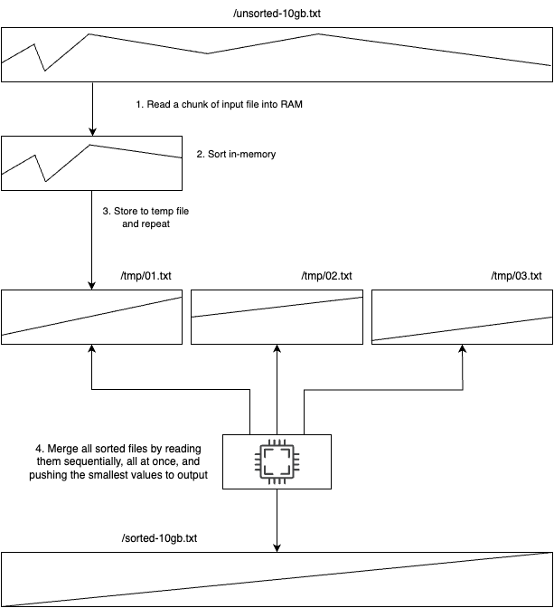

# File Sorter Solution

## Projects

*   **FileGenerator**: Generates large files containing lines with a random number and a random string, separated by a dot and a space.
*   **FileSorter**: Sorts the generated files using an external k-way merge sort algorithm.
*   **SortAuditor**: Verifies that the output file is correctly sorted.
*   **Common**: A shared library containing common models, helpers, and interfaces used across the solution.
*   **Common.Tests**: Unit tests for the Common project.

## How to Run

### Generate Files

```bash
# Setup a data directory (e.g., on a separate mounted drive)
export DATA_DIR=/data

# 1GB
dotnet run -c Release --project src/FileGenerator/FileGenerator.csproj --size 1000 --output $DATA_DIR/input-1gb.txt

# 10GB
dotnet run -c Release --project src/FileGenerator/FileGenerator.csproj --size 10000 --output $DATA_DIR/input-10gb.txt

# 100GB
dotnet run -c Release --project src/FileGenerator/FileGenerator.csproj --size 100000 --output $DATA_DIR/input-100gb.txt
```

### Sort Files

Command parameters:
```
Description:
  File Sorter - Sorts large text files with "Number. String" format

Usage:
  FileSorter [options]

Options:
  --input <input> (REQUIRED)             The input file path to sort.
  --output <output> (REQUIRED)           The output file path for the sorted result.
  --encoding <encoding>                  Character encoding to use for reading and writing files (utf8, ascii, utf16, utf32, or any .NET encoding name). [default: utf8]
  --chunk-size-mb <chunk-size-mb>        Maximum chunk size in MB. [default: 512]
  --max-file-handles <max-file-handles>  Maximum number of file handles to use. [default: 512]
  --temp-dir <temp-dir>                  Optional custom directory for temporary files.
  --version                              Show version information
  -?, -h, --help                         Show help and usage information
```

Using `dotnet run`:
```bash
dotnet run -c Release --project src/FileSorter/FileSorter.csproj --input $DATA_DIR/input-1gb.txt --output $DATA_DIR/output-1gb.txt --temp-dir $DATA_DIR/temp
dotnet run -c Release --project src/FileSorter/FileSorter.csproj --input $DATA_DIR/input-10gb.txt --output $DATA_DIR/output-10gb.txt --temp-dir $DATA_DIR/temp
dotnet run -c Release --project src/FileSorter/FileSorter.csproj --input $DATA_DIR/input-100gb.txt --output $DATA_DIR/output-100gb.txt --temp-dir $DATA_DIR/temp

# For very large files, consider running in the background:
nohup dotnet run -c Release --project src/FileSorter/FileSorter.csproj --input $DATA_DIR/input-100gb.txt --output $DATA_DIR/output-100gb.txt --temp-dir $DATA_DIR/temp > output.log 2>&1 &
```

### Audit Sorted Files

```bash
dotnet run -c Release --project src/SortAuditor/SortAuditor.csproj --original-file $DATA_DIR/input-10gb.txt --sorted-file $DATA_DIR/output-10gb.txt
```

## Sorting Approach: External K-Way Merge Sort

The `FileSorter` project implements an external k-way merge sort algorithm. This method is designed to sort datasets that are too large to fit into main memory. The process involves:

1.  **Chunking and In-Memory Sorting**:
    *   The large input file is read sequentially in manageable chunks (e.g., 128MB, 256MB, configurable).
    *   Each chunk is loaded into memory.
    *   The lines within the chunk are parsed into `ParsedLine` objects.
    *   These `ParsedLine` objects are sorted in memory based on the `StringValue` first, then by the `Number`.
    *   The sorted lines (original string format) from the chunk are written to a temporary file on disk.
    *   This process is repeated until the entire input file has been processed into multiple sorted temporary files (chunks).

2.  **K-Way Merging**:
    *   The sorted temporary files (chunks) are then merged together.
    *   A k-way merge algorithm is used.
    *   A min-heap is used to find the globally smallest line among the current lines from all active temporary files.



## Benchmarks

### EC2 - m7g.xlarge - gp3

| File Size | Time    | Memory Usage |
| :-------- | :------ | :----------- |
| 1 GB      | 20s     | 561MB        |
| 10 GB     | 4m 38s  | 558MB        |
| 100 GB    | 53m 17s | 591MB        |

### M1 Pro 32GB Mac

| File Size | Time   | Memory Usage |
| :-------- | :----- | :----------- |
| 1 GB      | 7.6s   | 1174MB       |
| 10 GB     | 1m 39s | 792MB        |
